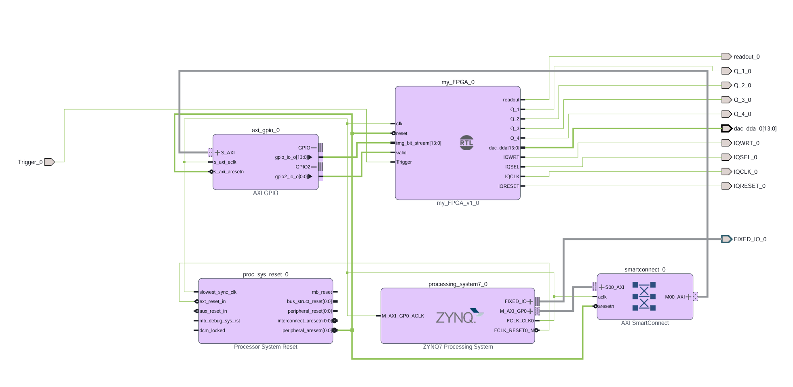

# FPGA-quantum-decoder
# Neutral Atom Array Image Processing (Red Pitaya STEMlab 125-14)
 
FPGA-based image processing pipeline for real-time detection, counting, and rearrangement of neutral atoms in an optical tweezer array, implemented on a Red Pitaya STEMlab 125-14 (Xilinx Zynq-7010). The system processes camera image data to locate atoms, uses closed-loop feedback to determine a rearrangement sequence to fill a target grid pattern, and outputs control signals via the onboard DAC to drive the rearrangement hardware (e.g. AOD/AOM). Uses ssh terminal to communicate with the board.
 
## Table of Contents
- [Overview](#overview)
- [Repository Structure](#repository-structure)
- [Architecture / Block Design](#architecture--block-design)
- [Requirements](#requirements)
- [Getting Started](#getting-started)
- [Constraints](#constraints)
- [Algorithm](#algorithm)
- [Simulation & Testbenches](#simulation--testbenches)
- [Building & Programming the Red Pitaya](#building--programming-the-red-pitaya)
- [Results / Verification](#results--verification)
- [Future Work](#future-work)
- [License](#license)
## Overview

- **Application:** Real-time image processing for neutral atom arrays in quantum computing
- **Target device:** [Red Pitaya STEMlab 125-14 (Xilinx Zynq-7010, dual-core ARM Cortex-A9 + programmable logic)](https://redpitaya.readthedocs.io/en/latest/developerGuide/hardware/ORIG_GEN/125-14/top.html#top-125-14)
- **Toolchain:**  [AMD Vivado 2026.1](https://www.xilinx.com/support/download.html) — download the **Self Extracting Web Installer** (~286 MB for Windows, ~394 MB for Linux), not the full offline SFD image (~98 GB). The web installer lets you select only the components you need (WebPACK license, Zynq-7000 device support) and downloads them on demand — no need for the full package.
- **Language:** VHDL
- **I/O:** 2x 14-bit ADC input channels (125 MSPS), 2x 14-bit DAC output channels (125 MSPS)
- **Pipeline:** Camera image in → atom detection/thresholding → counting → grid rearrangement decision → DAC output to rearrangement optics.

## Repository Structure
 
```
.
├── src/            # VHDL source files (RTL)
├── testbench/      # VHDL testbenches
├── constraints/    # Pin and timing constraints (.xdc)
├── docs/           # Block diagrams, waveforms, screenshots
├── sim/            # Simulation scripts / waveform configs
├── .gitignore
└── README.md
```
## Architecture / Block Design
  


After creating the main vhdl design, named my_FPGA, recreate the block design above. Block designs are useful modules that are good for integrating components without requiring putting together from scratch. In this design, we have integrated the boards internal clock of 125MHz, and a reset signal. Notice the labelling reset_n, n indicates negative, meaning it performs a reset when reset is driven low ( 0 ). Important to be consistent with the design to avoid getting stuck in reset mode. The block design also includes AXI GPIO, which is how we send the simulated image signals. Double click the module and enable dual channel. Set both channels to output only and set the first width to 14 and second to 1. Connect the 14 width port to img_bit_stream, and the other to valid. We will drive these using python in ssh.

Once built, go to the sources tab and right click the block design and create HDL wrapper. This converts the block diagrams into actual verilog code that can be understood by Vivado when implementing the design.
To note: After any edits, go to block design and refresh module to make updates. Validate design to check no wiring or hardware errors.

 Disable DDR, make Fixed IO external (Vivado deals with this pin itself), And make Trigger, and all the output ports in my_FPGA external.
Describe the pipeline stages, e.g.:
 
- **Image input interface** — how camera frame data enters the FPGA (via ADC channels directly, via PS-side capture and AXI stream into PL, GigE/CameraLink bridged through the ARM core, etc. — specify your actual interface)
- **Atom detection block** — thresholding / peak-finding logic that identifies atom presence at each expected lattice site from the image data
- **Counting block** — tallies detected atoms and produces the current occupancy grid
- **Rearrangement algorithm block** — compares current occupancy to the target pattern and computes the move sequence needed to fill it
- **DAC output stage** — converts the rearrangement move sequence into the analog control waveform(s) sent to the AOD/AOM driving the tweezer rearrangement [DAC methods - Go to interleaved mode, not dual port](https://www.analog.com/media/en/technical-documentation/data-sheets/AD9763_9765_9767.pdf) or access data sheet via [ANALOG DEVICES AD9767](https://www.analog.com/en/products/AD9767.html)
- **PS/PL interface** — what the ARM core (Zynq PS) handles vs. what runs in FPGA fabric (PL) — e.g. PS for configuration/monitoring, PL for the real-time detection and DAC pipeline
If there's a top-level state machine (e.g. IDLE → CAPTURE → DETECT → DECIDE → OUTPUT), a state diagram here is worth including.


## Getting Started
 
1. Clone the repository:
```bash
   git clone https://github.com/<your-username>/<repo-name>.git
   cd <repo-name>
```
2. If building on the Red Pitaya base project, clone/reference it separately and follow their setup instructions for generating the base block design before adding this project's custom IP.
3. Open the project in Vivado (or recreate it from the provided `.tcl` build script, if included).
4. Set the top-level VHDL file as the top module.
5. Run synthesis, implementation, and generate the bitstream.
6. Connect power to the board and switch on. Use ethernet to connect to pc.
7. Wait roughly 20 s then type rp-xxxxxx.local in web address to verify communication between board and pc.
8. Once web browser loads, open windows command terminal and type scp C:\path\Design_name_wrapper.bit root@rp-xxxxxx.local:/tmp/
9. ssh root@rp-xxxxxx.local
10. cat /tmp/Design_name_wrapper.bit > /dev/xdevcfg
11. In a separate window, load txt file.
12. back in ssh terminal open python nano test.py
13. paste test python code and save and exit
14. run python3 test.py and look for waveform on oscilloscope out of DAC.
15. [Network Manager](https://redpitaya.readthedocs.io/en/latest/appsFeatures/systemtool/network_manager/networkManager.html).

   
## Constraints
 
The `.xdc` file(s) in `constraints/` define the Red Pitaya's fixed pin mapping for:
 
- **ADC input pins** — connects to the onboard 14-bit ADC channels carrying camera/image signal data
- **DAC output pins** — connects to the onboard 14-bit DAC channels driving the rearrangement control signal
- **System clock** — the Red Pitaya's onboard clock source and PLL configuration
- **GPIO / expansion connector pins** — if using the extension header for additional camera or trigger I/O
Red Pitaya's official repository provides a reference `.xdc` for the STEMlab 125-14 — reuse it as the base rather than remapping pins from scratch, since the ADC/DAC/clock connections are fixed by the board layout. To find correct pin mapping, navigate to [Schematics_STEM_125-14_v1.1.pdf](https://redpitaya.readthedocs.io/en/latest/developerGuide/hardware/ORIG_GEN/125-14/top.html#top-125-14).

## Algorithm
 
Describe the detection and rearrangement algorithm in more detail here, e.g.:
 
- **Detection:** how a site is classified as occupied/empty from the raw image (thresholding method, filtering, calibration approach)
- **Counting:** how the total atom count and occupancy grid are represented in hardware (e.g. bit vector, register array)
- **Rearrangement strategy:** the logic used to decide which atoms move where to fill the target pattern (e.g. row-by-row, column compaction, or a specific published rearrangement algorithm you implemented/adapted)
- **Timing:** how fast this runs end-to-end (important for atom trapping — rearrangement usually needs to happen within the atom lifetime/trap coherence window)


## Simulation & Testbenches
 
Each module has a corresponding testbench in `testbench/`.
simulation often has max timing it can simulate. Scale down slowed clock and output_del to 4 and 10 to see logic clearly in waveforms.
 
**Running with Vivado XSIM:**
1. Add the testbench and set it as the simulation top.
2. Run Behavioral Simulation.
3. Inspect waveforms in the Wave window — check detection thresholds trigger correctly against synthetic image test vectors, and DAC output timing matches expected rearrangement sequence.
Describe what each key testbench validates, e.g. "`atom_detect_tb.vhd` feeds synthetic image frames with known atom positions and checks the detection block's occupancy output against expected values."
 
## Building & Programming the Red Pitaya
 
1. Run Synthesis → Implementation → Generate Bitstream in Vivado.
2. Transfer the bitstream to the Red Pitaya (via its web interface, SCP over the network, or SD card boot image depending on your workflow).
3. Load the FPGA image on boot or via the Red Pitaya's runtime FPGA loading mechanism.
4. Describe your verification step — e.g. "confirm DAC output waveform on an oscilloscope matches the expected rearrangement pulse pattern for a known test image."

 


## Results / Verification
 
Summarize what's been verified: simulation results against known image test vectors, on-hardware detection accuracy, end-to-end latency from image capture to DAC output, and resource utilization (LUTs, FFs, BRAM, DSP slices) on the Zynq-7010 fabric.
 
## Future Work

-Test with real images from a camera using ADC.

-List known limitations or planned improvements (e.g. faster rearrangement algorithm, higher resolution imaging support).
Could look into faster or more sophisticated rearrangement algorithm. [ATLAS algorithm](https://arxiv.org/html/2511.16303v1)

-Make generics editable on face level rather than within the design vhdl code, via a text file for example. Means we don't have to open vivado every time we make a change. Few ways of doing this, some more complicated than others. [Generics/parameter examples](https://www.doulos.com/knowhow/fpga/settings-genericsparameters-for-synthesis/)
